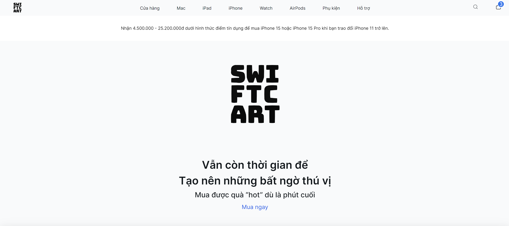
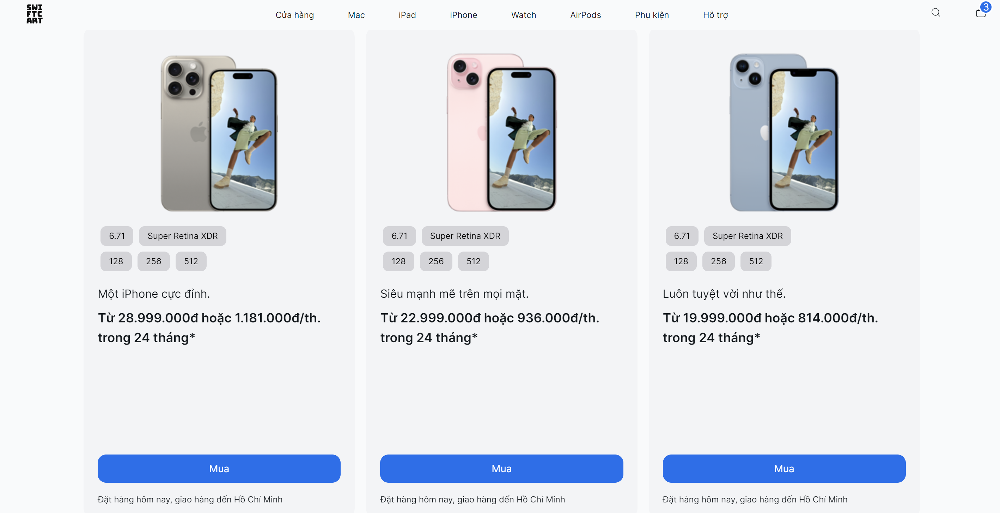

# Swipe eCommerce web application

Swipe eCommerce is an e-commerce website for businesses selling products from the Apple brand, built with Next.js and TailwindCSS.

## Getting Started

1. Required software

- Yarn

2. Installing the app

```bash
git clone https://github.com/swclabs/swipe-app
cd swipe-app
yarn install
```

3. Required environment variables
4. Running the app

- Type `yarn run dev` to start the local server
- Open `http://localhost:3000/` in your browser




